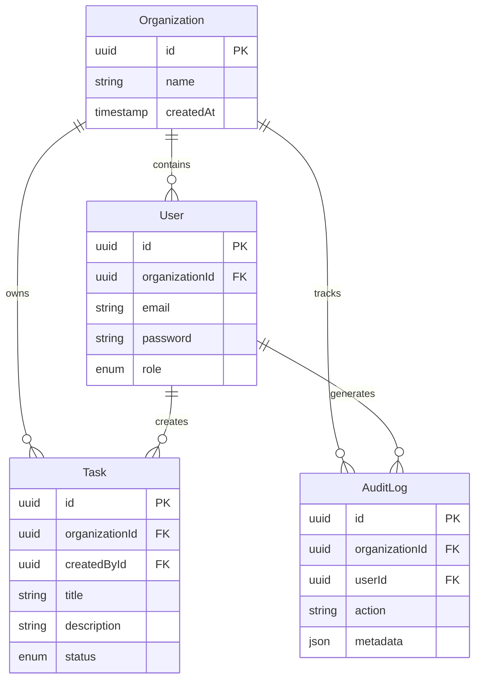

# 🔐 Secure Task Management System

<div align="center">

**A production-ready, multi-tenant task management platform with enterprise-grade security**

**Tech Stack:** NestJS • Angular • TypeScript • NX Monorepo • JWT • TYpeORM

[Features](#-features) • [Quick Start](#-quick-start) • [Architecture](#-architecture) • [API Docs](#-api-documentation) • [Security](#-security) • [Demo](#-demo)

</div>

---

## 📋 Overview

A full-stack task management system built with **NestJS** and **Angular** in an **NX monorepo**. Features organization-scoped multi-tenancy, role-based access control (RBAC), and comprehensive audit logging.

**Turbovets Assessment Submission**  
👤 **Author:** Sai Teja Bandaru  
📧 **Email:** saiteja.bandaru03@gmail.com  
📱 **Phone:** +1 (682) 336-2337

---

## ✨ Features

- 🏢 **Multi-tenant Architecture** - Organization-scoped data isolation
- 🔐 **JWT Authentication** - Secure token-based auth with refresh capabilities
- 👥 **Role-Based Access Control** - Owner, Admin, and Viewer roles
- 📝 **Task Management** - Full CRUD operations with organization scoping
- 📊 **Audit Logging** - Comprehensive activity tracking
- 🛡️ **Defense-in-Depth Security** - Multi-layer authorization checks
- 🏗️ **Monorepo Structure** - Shared code with independent deployment
- 🎨 **Modern UI** - Responsive Angular dashboard

---

## 🎥 Demo

🎬 **[Watch Demo Video](link-to-your-demo-video)** - See the application in action!

---

## 🚀 Quick Start

### Prerequisites

- Node.js 18+ and npm
- Git

### Installation

```bash
# Clone the repository
git clone https://github.com/saitejabandaru23/sbandaru-14d52b51-f92f-4c15-a588-88e66bee13e9.git
cd sbandaru-14d52b51-f92f-4c15-a588-88e66bee13e9

# Install dependencies
npm install --legacy-peer-deps
```

### Running the Application

#### Backend (NestJS)
```bash
npx nx serve @org/api
```
🌐 Backend runs at: **http://localhost:3000**

#### Frontend (Angular)
```bash
npx nx serve dashboard
```
🌐 Frontend runs at: **http://localhost:4200**

### Environment Configuration

Create `apps/api/.env`:
```env
DATABASE_URL=file:./dev.db
JWT_SECRET=your-secret-key-here
JWT_EXPIRATION=1h
```

---

## 🏗️ Architecture

### Monorepo Structure

```
.
├── apps/
│   ├── api/              # NestJS backend
│   │   ├── src/
│   │   │   ├── auth/     # Authentication & JWT
│   │   │   ├── tasks/    # Task management
│   │   │   ├── audit/    # Audit logging
│   │   │   └── guards/   # Authorization guards
│   │   └── .env
│   └── dashboard/        # Angular frontend
│       └── src/
└── libs/                 # Shared libraries
```

### Technology Stack

| Layer | Technology |
|-------|-----------|
| **Frontend** | Angular 18+, TypeScript, RxJS |
| **Backend** | NestJS, TypeScript, Prisma ORM |
| **Database** | SQLite (dev), PostgreSQL-ready |
| **Auth** | JWT, Passport.js |
| **Monorepo** | NX Workspace |

---

## 📊 Data Model

### Entity Relationship Diagram



### Core Entities

- **Organization**: Tenant boundary for multi-tenancy
- **User**: Authenticated entity with role-based permissions
- **Task**: Work items scoped to an organization
- **AuditLog**: Immutable record of all system actions

---

## 🔐 Security

### Access Control Model

```
┌─────────────────────────────────────────┐
│         Request with JWT Token          │
└──────────────┬──────────────────────────┘
               │
               ▼
┌─────────────────────────────────────────┐
│       JWT Guard (Token Validation)      │
│   Extracts: userId, role, orgId         │
└──────────────┬──────────────────────────┘
               │
               ▼
┌─────────────────────────────────────────┐
│     Role Guard (Permission Check)       │
│   Validates: Required role vs user role │
└──────────────┬──────────────────────────┘
               │
               ▼
┌─────────────────────────────────────────┐
│   Service Layer (Org-Scoped Queries)    │
│   WHERE organizationId = user.orgId     │
└─────────────────────────────────────────┘
```

### Role Permissions

| Role | Permissions |
|------|-------------|
| **Owner** | Full access to all organization resources |
| **Admin** | Create, read, update, delete tasks |
| **Viewer** | Read-only access to tasks |

### Security Features

- ✅ JWT-based authentication with secure token storage
- ✅ Organization-scoped data isolation (row-level security)
- ✅ Role-based access control (RBAC)
- ✅ Defense-in-depth: Guard + Service layer enforcement
- ✅ Audit logging for compliance and forensics
- ✅ Password hashing with bcrypt

---

## 📡 API Documentation

### Authentication Endpoints

#### Register New User
```http
POST /api/auth/register
Content-Type: application/json

{
  "email": "user@example.com",
  "password": "SecurePass123!",
  "organizationName": "Acme Corp",
  "role": "admin"
}
```

#### Login
```http
POST /api/auth/login
Content-Type: application/json

{
  "email": "user@example.com",
  "password": "SecurePass123!"
}

Response:
{
  "accessToken": "eyJhbGciOiJIUzI1NiIsInR5cCI6IkpXVCJ9..."
}
```

#### Get Current User
```http
GET /api/auth/me
Authorization: Bearer <token>
```

---

### Task Management Endpoints

#### List Tasks (Org-Scoped)
```http
GET /api/tasks
Authorization: Bearer <token>
```

#### Create Task
```http
POST /api/tasks
Authorization: Bearer <token>
Content-Type: application/json

{
  "title": "Implement feature X",
  "description": "Add new authentication flow",
  "status": "pending"
}
```

#### Update Task
```http
PUT /api/tasks/:id
Authorization: Bearer <token>
Content-Type: application/json

{
  "title": "Updated title",
  "status": "in-progress"
}
```

#### Delete Task
```http
DELETE /api/tasks/:id
Authorization: Bearer <token>
```

---

### Audit Log Endpoints

#### Get Audit Logs (Org-Scoped)
```http
GET /api/audit-log
Authorization: Bearer <token>

Query Parameters:
- page (optional): Page number
- limit (optional): Items per page
```

---

## 🚧 Future Roadmap

### Phase 1: Enhanced Security
- [ ] Refresh token rotation and revocation
- [ ] CSRF protection for cookie-based flows
- [ ] Strict CORS allowlist configuration
- [ ] Security headers (Helmet.js integration)
- [ ] Rate limiting and DDoS protection

### Phase 2: Advanced RBAC
- [ ] Custom role creation per organization
- [ ] Fine-grained permission delegation
- [ ] Resource-level permissions
- [ ] Redis-based RBAC caching for high throughput

### Phase 3: Production Hardening
- [ ] Migration from SQLite to PostgreSQL
- [ ] Database migration management (Prisma Migrate)
- [ ] Automated backups and disaster recovery
- [ ] Horizontal scaling support
- [ ] CI/CD pipeline integration

### Phase 4: Observability
- [ ] Structured logging (Winston/Pino)
- [ ] Metrics collection (Prometheus)
- [ ] Distributed tracing (OpenTelemetry)
- [ ] Health check endpoints

---

## 🧪 Testing

```bash
# Unit tests
npx nx test api
npx nx test dashboard

# E2E tests
npx nx e2e api-e2e

# Test coverage
npx nx test api --coverage
```

---

## 📦 Building for Production

```bash
# Build backend
npx nx build api --prod

# Build frontend
npx nx build dashboard --prod
```

Artifacts will be available in `dist/apps/`

---

## 🤝 Contributing

Contributions are welcome! Please feel free to submit a Pull Request.

1. Fork the repository
2. Create your feature branch (`git checkout -b feature/AmazingFeature`)
3. Commit your changes (`git commit -m 'Add some AmazingFeature'`)
4. Push to the branch (`git push origin feature/AmazingFeature`)
5. Open a Pull Request

---

## 📞 Contact

**Sai Teja Bandaru**

- 📧 Email: [saiteja.bandaru03@gmail.com](mailto:saiteja.bandaru03@gmail.com)
- 📱 Phone: +1 (682) 336-2337
- 💼 LinkedIn: [Sai Teja B](https://www.linkedin.com/in/sai-teja-b-858b502b2/)
- 🐙 GitHub: [@saitejabandaru23](https://github.com/saitejabandaru23)

---

<div align="center">

**Built with ❤️ using NestJS, Angular, and NX**

[⭐ View Repository on GitHub](https://github.com/saitejabandaru23/sbandaru-14d52b51-f92f-4c15-a588-88e66bee13e9)

</div>
